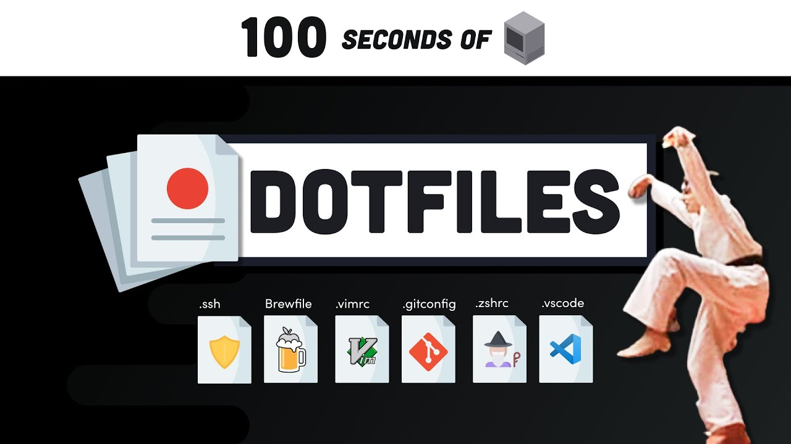

# Beyond Dotfiles in 100 Seconds

[](https://youtu.be/r_MpUP6aKiQ "Dotfiles in 100 Seconds on YouTube")

Watch the [video collaboration](https://youtu.be/r_MpUP6aKiQ "Dotfiles in 100 Seconds on YouTube") between [fireship.io](https://fireship.io/ "Build and ship 🔥 your app ⚡ faster") and [eieio.xyz](http://dotfiles.eieio.xyz "Dotfiles from Start to Finish-ish"). And don't forget to [subscribe](https://fireship.page.link/youtube "Fireship YouTube Channel") while you're there!

Then, go ***way*** beyond 100 seconds by taking the full course on Udemy, [***Dotfiles from Start to Finish-ish***](https://www.udemy.com/course/dotfiles-from-start-to-finish-ish/?referralCode=445BE0B541C48FE85276 "Learn Dotfiles from Start to Finish-ish on Udemy"
) (aka "Dotiles in 15240 Seconds and Growing"). Keep an eye on [Twitter](https://twitter.com/EIEIOxyz "@EIEIOxyz") and [YouTube](https://www.youtube.com/channel/UCcZZOzRKMbql7IEL0midfgQ "EIEIO YouTube Channel") for updates to the course.


## Steps to bootstrap a new Mac

1. Install Apple's Command Line Tools, which are prerequisites for Git and Homebrew.

```zsh
xcode-select --install
```


2. Clone repo into new hidden directory.

```zsh
# Use SSH (if set up)...
git clone git@github.com:eieioxyz/Beyond-Dotfiles-in-100-Seconds.git ~/.dotfiles

# ...or use HTTPS and switch remotes later.
git clone https://github.com/eieioxyz/Beyond-Dotfiles-in-100-Seconds.git ~/.dotfiles
```


3. Create symlinks in the Home directory to the real files in the repo.

```zsh
# There are better and less manual ways to do this;
# investigate install scripts and bootstrapping tools.

ln -s ~/.dotfiles/.zshrc ~/.zshrc
ln -s ~/.dotfiles/.gitconfig ~/.gitconfig
```


4. Install Homebrew, followed by the software listed in the Brewfile.

```zsh
# These could also be in an install script.

# Install Homebrew
/bin/bash -c "$(curl -fsSL https://raw.githubusercontent.com/Homebrew/install/HEAD/install.sh)"

# Then pass in the Brewfile location...
brew bundle --file ~/.dotfiles/Brewfile

# ...or move to the directory first.
cd ~/.dotfiles && brew bundle
```


## TODO List

- Learn how to use [`defaults`](https://macos-defaults.com/#%F0%9F%99%8B-what-s-a-defaults-command) to record and restore System Preferences and other macOS configurations.
- Organize these growing steps into multiple script files.
- Automate symlinking and run script files with a bootstrapping tool like [Dotbot](https://github.com/anishathalye/dotbot).
- Revisit the list in [`.zshrc`](.zshrc) to customize the shell.
- Make a checklist of steps to decommission your computer before wiping your hard drive.
- Create a [bootable USB installer for macOS](https://support.apple.com/en-us/HT201372).
- Integrate other cloud services into your Dotfiles process (Dropbox, Google Drive, etc.).
- Find inspiration and examples in other Dotfiles repositories at [dotfiles.github.io](https://dotfiles.github.io/).
- And last, but hopefully not least, [**take my course, *Dotfiles from Start to Finish-ish***](https://www.udemy.com/course/dotfiles-from-start-to-finish-ish/?referralCode=445BE0B541C48FE85276 "Learn Dotfiles from Start to Finish-ish on Udemy"
)!

## Thank You!

I offer the most massive of thanks to [Jeff](https://twitter.com/jeffdelaney23 "Follow Jeff Delaney on Twitter") for giving me a few minutes on [his stage](https://fireship.page.link/youtube "Fireship YouTube Channel"). Please thank him for me by liking, sharing, subscribing, and taking a look at [fireship.io](https://fireship.io/ "Build and ship 🔥 your app ⚡ faster").
